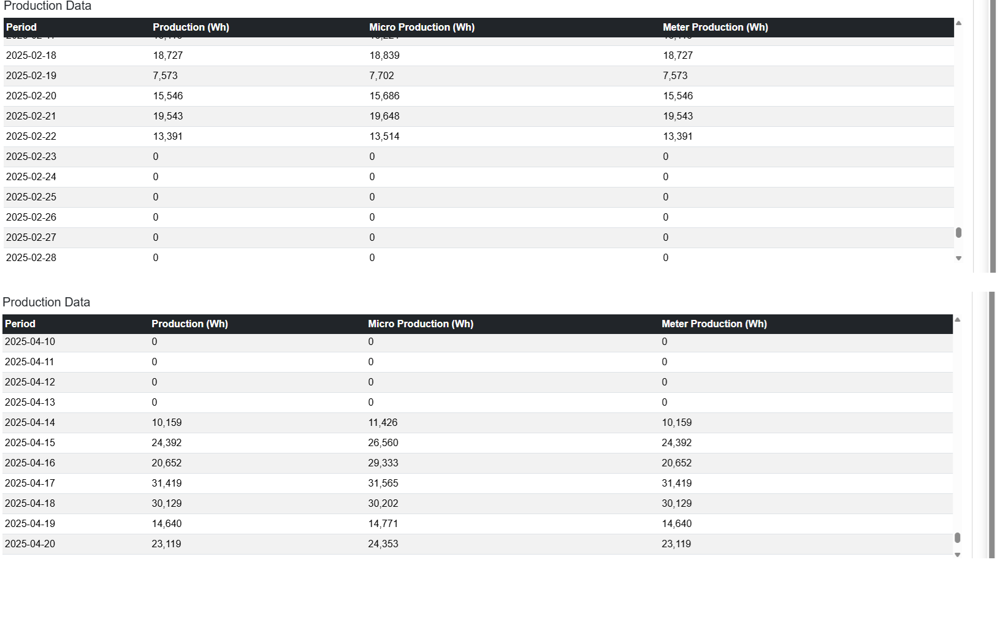
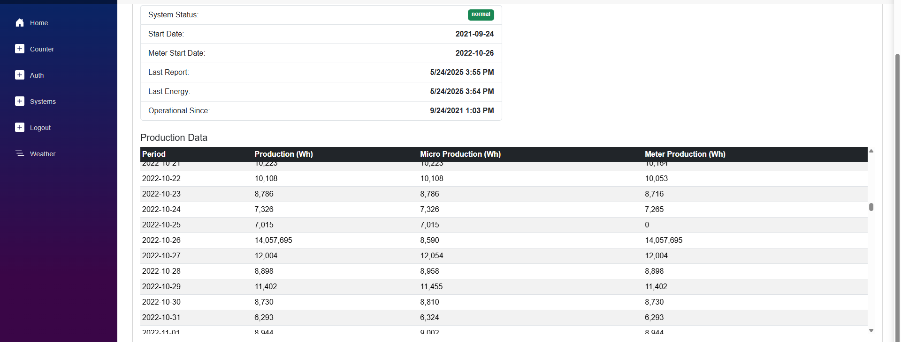

# Historical Data Insights

Seeing the data from the Enphase API has been very enlightening. I created a couple
of screenshots to show two issues evidenced by the data.

The first screenshot shows the production data for the issue that caused me to
write this app. It shows that the system stopped communicating with Enphase as of 2/23/2025:

(Note - if you haven't read the [BackStory.md](BackStory.md) file, what follows this may not 
make sense.)

The note in my account was from approximaately 4 weeks later, and the RMA request was placed 
at that time. As discussed elsewhere, nothing resulted from that request. I first noticed this 
and called them on 04/08, and it took over a week to get the Envoy replaced on 04/13, at which 
time the communication was restored. There was some discussion during this time that the system 
stored at least some data locally and would upload the data once communications resumed, but 
the picture shows that to be untrue.

The second screenshot (below) shows another anomaly in the production data on 10/26/2022. Up 
until the day before, the Production value always matched the Micro Production value, while 
the Meter Production value was always slightly less. On the 25th, the Meter Production value 
was 0, and the next day it was 14 million, even though the system only generates perhaps 
20k on average.

From that day forward, the Production value matched the Meter Production value, which remains 
slightly less than the Micro Production value. This is a mystery that I have not yet solved.
(It was not due to the installation of a smart meter, because that happened before the system
went live.)

I first thought that this anomaly with the meter was related to the delay I experienced with
getting SREC credits for the first year, but my email history shows that the dates are different.
Although I applied in March of 2022, SRECTrade claimed that they could not process it in time for
any 2022 production to count towards SRECs due to a backlog. It would have been nice to get
credit for that 14 million production value, even if it was incorrect!

